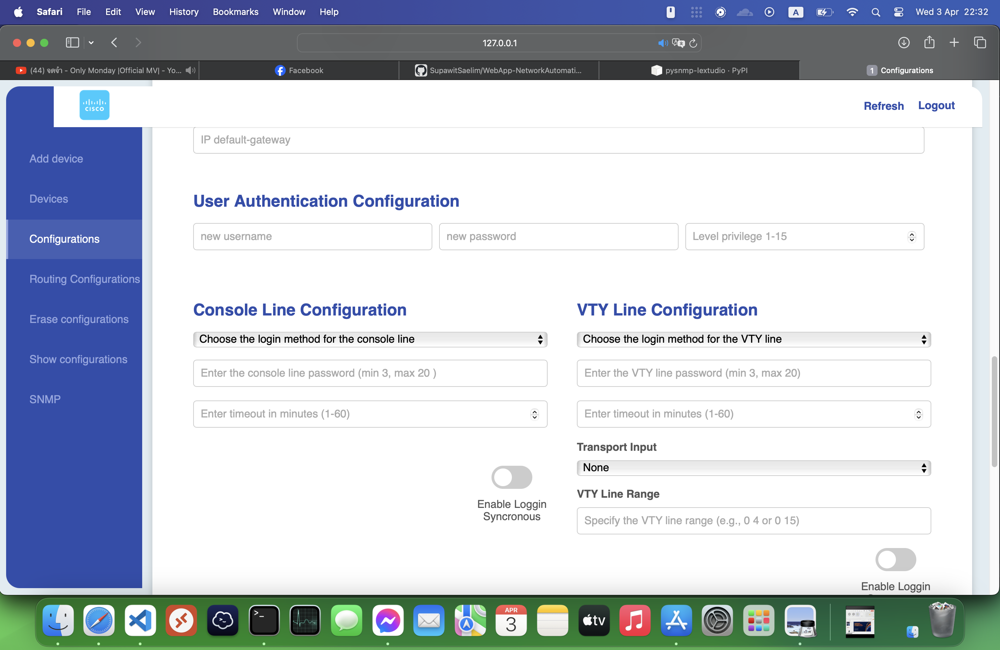
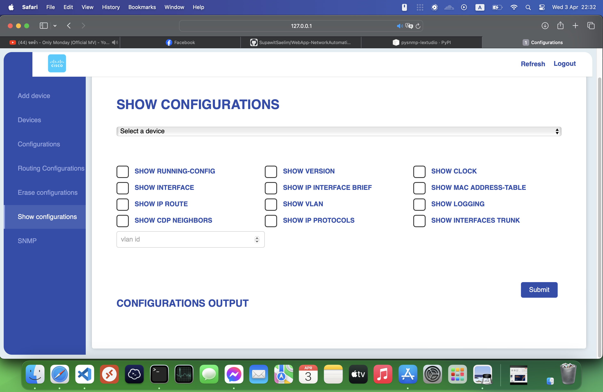

# Network Device Management Web Application: Cisco Configurator

"This is a web application project for configuring network devices such as Cisco routers and switches. The project aims to enable system administrators to easily inspect, modify, add, or remove network devices. However, there is one essential requirement: the devices must be configured with SSH, as this is necessary for proper backend utilization."

"One of the advantages is that we can add multiple devices to the database and send configuration commands simultaneously (using threading), thereby saving time for system administrators.

